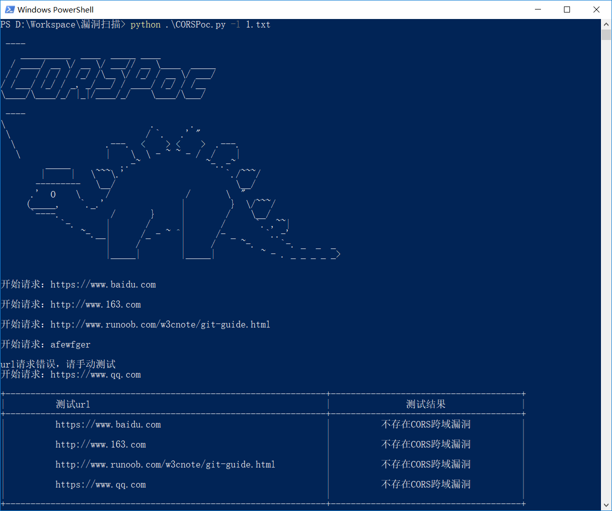

# About CORSPoc

CORSPoc是一个用于CORS跨域漏洞检测的python工具,它目前支持直接输入url和从txt文本中逐行提取url进行测试，对结果以表格的形式输出在命令行，可以自定义cookies和date（注：添加 date默认为post请求），url中不提供协议时候默认为https，后续考虑支持多线程。

# Python版本

 - python版本为3.x

# 安装

 - clone到本地

`git clone https://github.com/w3c2sh5b99phon1/CORSPoc.git`

 - 安装依赖关系

`pip install -r requirements.txt`

CORSPoc依赖于requests,PrettyTable,docopt.

# 使用说明

CORS跨域漏洞检测.
## Usage:
  CORSPoc.py [-u <url> | -l <file>] [--cookies=<cookies>] [--date=<date>]

  CORSPoc.py (-h | --help)

## Options:
  -h --help              显示帮助

  -u <url>               添加url 

  -l <file>              添加file

  --cookies=<cookies>    添加cookies

  --date=<date>          post数据包

## Example:
  CORSPoc.py -u "https://www.baidu.com"

  CORSPoc.py -l domain.txt

# 截图

# 版本

当前版本为1.0